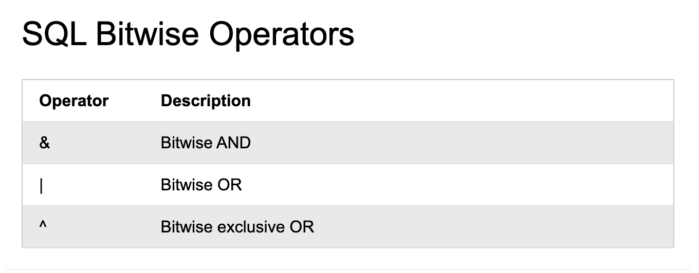

## SQL Comments
[sql](https://www.w3schools.com/sql/sql_comments.asp)

Comments are used to explain sections of SQL statements, or to prevents
execution of SQL statements.
```
NOTE:Comments are not supported in Microsoft Access databases!
```
## Single Line Comments
Single line comments start with `--`.
Any text between -- and the end of the line will be ignored (will not be executed)
The following example uses a  single-line comment as an explanation:
```
-- Select all:
SELECT * FROM Customers;
```
## The following example uses a single-line comment to ignore the end of a line:
```
SELECT * FROM Customers -- WHERE City='Berlin';
```
## The following example uses a single-line comment to ignore a statement:
```
-- SELECT * FROM Customers;
SELECT * FROM Products;
```

## Multi-line Comments
Multi-line comments start with `/*` and end with `*/`

Any text between /* and */ will be ignored.
The following example uses a multi-line comment as an explanation:
```
/*Select all the columns
of all the records in the Customers table: */
SELECT * FROM Customers;
```
## The following example uses a multi-line comment to ignore many statements:

```
/*SELECT * FROM Customers;
SELECT * FROM Products;
SELECT * FROM Orders;
SELECT * FROM Categories; */
SELECT * FROM Suppliers;

```
## To ignore just a part of a statement, also use the /* */ comment.
The following example uses a comment to ignore part of  a line:

```
SELECT CustomerName, /*City,*/ Country FROM Customers;
```
## The following example uses a comment to ignore part of a statement:
```
SELECT * FROM Customers WHERE (CustomerName LIKE 'L%'
OR CustomerName LIKE 'R%' /*OR CustomerName LIKE 'S%'
OR CustomerName LIKE 'T%' */ OR CustomerName LIKE 'W%')
AND Country='USA'
ORDER BY CustomerName;
```
## SQL Operators
## SQL Arithmetic Operators

| 列标题1 | 列标题2 | 列标题3 |
| :--- | :---: | ---: |
| 单元格1 | 单元格2 | 单元格3 |
| 单元格4 | 单元格5 | 单元格6 |


|Operator |Description| Example|
| :---------|:--------:|-----:|

| "+ "        | ADD      | NOTE     |

|-           |Subtract |   example |
|*            |Multiply|   example |
|/             |Divide |   example |
|%            |Modulo |   example |



## sql comparison operators
|Operator |Description|Example|
|:--------|:----------:|------:|
| =        |Equal to   |  EXAMPLE|
| >        |Greater than  |  EXAMPLE|
| <       |Less than  |  EXAMPLE|
| >=     |Greater than or equal to  |  EXAMPLE|
| <=        |Less than or equal to   |  EXAMPLE|
| <>        |Not Equal to   |  EXAMPLE|
 
 ## SQL Compound Operators
 |Operator | Description|
 |:--------|-----------:|
 |+=| Add equals|
 |-=| Subtract equals|
 |*=| Multiply  equals|
 |/=| Divide equals|
 |%=| Modulo equals|
 |&=| Bitwise and equals|
 |^=| Bitwise exclusive equals|
 | |*=| Bitwise OR equals|

## sql logical operators
