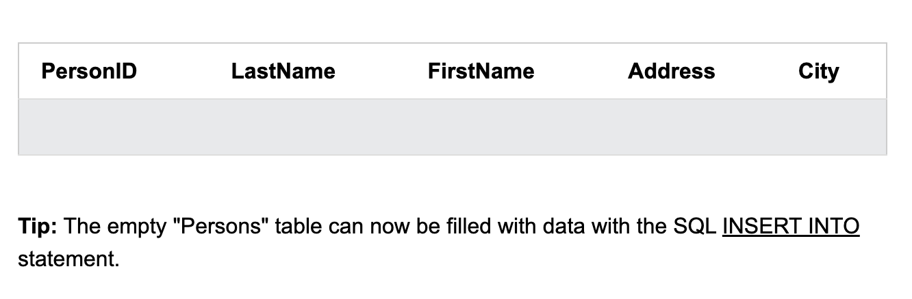

# sql create table statement

## The sql create table Statement
The `create table` statement is used to create a new table in a database.

## Syntax
```
CREATE TABLE table_name{
    column1 datatype
    column2 datatype
    column3 datatype,
    ...
};
```
The column parameters specify the names of the columns of the table.
The datatype parameter specifies the type of data the column can hold(e.g.
varchar,integer, date, etc.)/
## tip:
for an overview of the available data types, go to our complete `data types reference`

## sql create table example

```
CREATE TABLE Persons (
    PersonID int,
    LastName varchar(255),
    FirstName varchar(255),
    Address varchar(255),
    City varchar(255)
);
```

## TIPs: The empty "Persons" table can now be filled with data with 
the SQL INSERT INTO statement。

##  CREATE TABLE Using Another Table
A copy of  an existing table can also be created using ' create table'.

##  Syntax
```
CREATE TABLE new_table_name AS 
    SELECT column1,column2,...
    FROM existing_table_name
    WHERE ....;
```

## The following SQL creates  a new table called "testTable" (which is a copy of the "Customers" table):

```
CREATE TABLE TestTable AS
SELECT customername, contanctname
FROM customers;
```
##  SQL DROP TABLE Statement

The `DROP TABLE` statement is used to drop an existing table in 
a database.
## Syntax
```
DROP TABLE table_name;
```
**NOTE** Be careful before dropping a table. Deleting a table will 
result in loss of complete information stored in the table!

## example
```
DROP TABLE Shippers;
```
## sql truncate table

The `TRUNCATE TABLE` statement is used to delete the data inside 
a table, but not the table itself.
## Syntax
```
TRUNCATE TABLE table_name;
```
